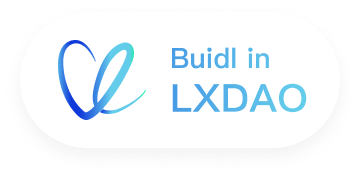

# My First NFT Contract

This is the MyFirstNFT Contract project.

MyFirstNFT is a non-profit instructional project for Web3 newbies. Get a FREE NFT while learning about Web3, NFT, and security. Buidl in [LXDAO](https://lxdao.io/).

- MyFirstNFT Website: <https://myfirstnft.info>
- MyFirstNFT Twitter: <https://twitter.com/mfnft_official>
- LXDAO Website: <https://lxdao.io/>
- LXDAO Forum: <https://forum.lxdao.io/c/projects/001-mfnft/14>
- LXDAO Discord: <https://discord.lxdao.io>
- LXDAO Twitter: <https://twitter.com/LXDAO_Official>

As it is a public goods, all of the source code are opened:

- Main Website: <https://github.com/lxdao-official/myfirstnft-frontend>
- Backend API: <https://github.com/lxdao-official/myfirstnft-backend>
- NFT Contract: <https://github.com/lxdao-official/myfirstnft-contract>

Enjoy!

TODO improving documents. The contract code is `contracts/MyFirstNFT.sol`.

## Run unit tests

TODO improving unit tests

```
npm install
npx hardhat test
```

## Deploy

```
npx hardhat compile
npm run deploy:rinkeby
```

## What is LXDAO?

LXDAO is an R&D-focused DAO in Web3. Our mission is: To bring together buidlers to buidl and maintain valuable projects for Web3, in a sustainable manner.

<a target="_blank" href="https://lxdao.io/"></a>
